# B站AI视频弹幕生态与业务策略模型

**作者**：Hailin Liu

---

## 摘要

本研究基于B站AI/科技区6,155条视频及弹幕数据，采用FP-Growth关联规则挖掘、Louvain社区检测、DTW时间序列分析、中断时间序列(ITS)、事件研究法及ANOVA等方法，系统分析B站AI内容生态的统计规律。核心发现："AI+搞笑"标签组合相对表现(RP)达1.59（p<0.001），标题-标签一致性呈U型关系（β₂=2.0045, p=0.006），AI事件B站响应周期因类型而异（显著/视觉型8天、复杂/技术型14天+）。业务建议：创作者应优先采用"AI+搞笑"标签组合与"教程入门型"标题范式，并根据事件类型把握发布时机。

---

## 1. 引言


随着生成式AI技术的快速迭代，视频平台已成为AI知识传播与公众讨论的核心场域。现有研究主要聚焦于社交媒体内容推荐算法优化与用户行为分析，Li, Z., Li, R., & Jin, G. (2020)构建了弹幕情感分析框架，Zhang, Y., et al. (2022)探索了可解释的视频标签推荐系统，Coursaris, C. K., et al. (2023)则揭示了内容特征对用户参与度的影响机制。


然而，既有研究存在三方面空白：其一，缺乏针对新兴AI内容生态的系统性实证分析；其二，未建立统计显著性与业务决策的映射框架；其三，在数据稀疏下，研究采样偏差对结论可靠性的影响。


本研究以B站AI区为研究对象，构建涵盖标签组合效率、标题优化、弹幕语义演化、事件响应时序的多维分析框架，旨在为内容创作者提供数据驱动的策略建议。

---

## 2. 文献综述

本节回顾与本研究主题相关的三项代表性学术工作。

| 论文 | 方法 | 核心结论 |
|:-----|:-----|:---------|
| Sentiment Analysis of Danmaku Videos Based on Naïve Bayes and Sentiment Dictionary | 朴素贝叶斯+情感词典，七维情感分类 | 构建弹幕专用情感词典，实现情感得分与极性检测，可获取七维情感时间分布 |
| Interpretable Video Tag Recommendation with Multimedia Deep Learning Framework. | CNN多媒体框架+层级相关性传播 | 首个可解释视频标签推荐系统，用户信任度提升，推荐性能优于SOTA |
| Social Media Marketing Content Strategy: A Comprehensive Framework and Empirically Supported Guidelines for Brand Posts on Facebook Pages. | 内容分析法+ANOVA+Welch检验 | 多媒体内容、情感诉求显著影响参与度，工作日发帖效果更佳 |

上述论文在弹幕情感分析、标签推荐、内容策略领域具有重要指导意义。本项目在此基础上扩展讨论：（1）从单维情感分类扩展至情感-时序-事件三维关联分析；（2）从标签推荐的可解释性延伸至标签组合效率的因果推断；（3）从品牌帖子内容策略拓展至创作者内容优化策略，结合RP相对指标校正配额偏差。

---

## 3. 数据集说明

### 3.1 数据收集

本研究采用B站API进行数据采集，以 "AI焦虑" "科技" "人工智能" "DeepSeek" 等为核心搜索标签，覆盖2024年至2025年共8个季度。采集策略设定播放量≥50,000且弹幕数≥50为过滤阈值，最终获取6,393条视频记录及对应弹幕数据。需特别指出，科技标签采集页数为其他标签的50%（5页 vs 10页），此配额不均构成系统性采样偏差，后续分析采用相对指标进行校正。

### 3.2 数据清洗

原始数据经四步清洗流程：bvid去重剔除311条重复记录，播放量与弹幕数阈值过滤保留6,177条，最终通过视频-弹幕双向匹配确认有效样本**6,155条**。

### 3.3 探索性数据分析

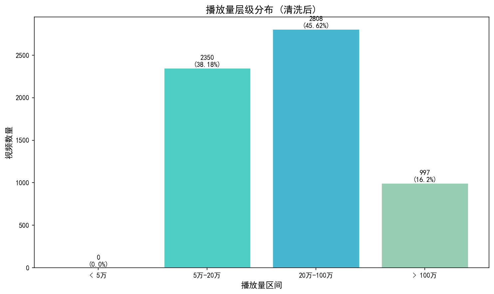

播放量分布呈现右偏特征：20万-100万区间占比最高（45.62%，n=2,808），5万-20万次之（38.18%，n=2,350），百万级爆款占比16.2%（n=997）。该分布验证了采集规则的有效性。

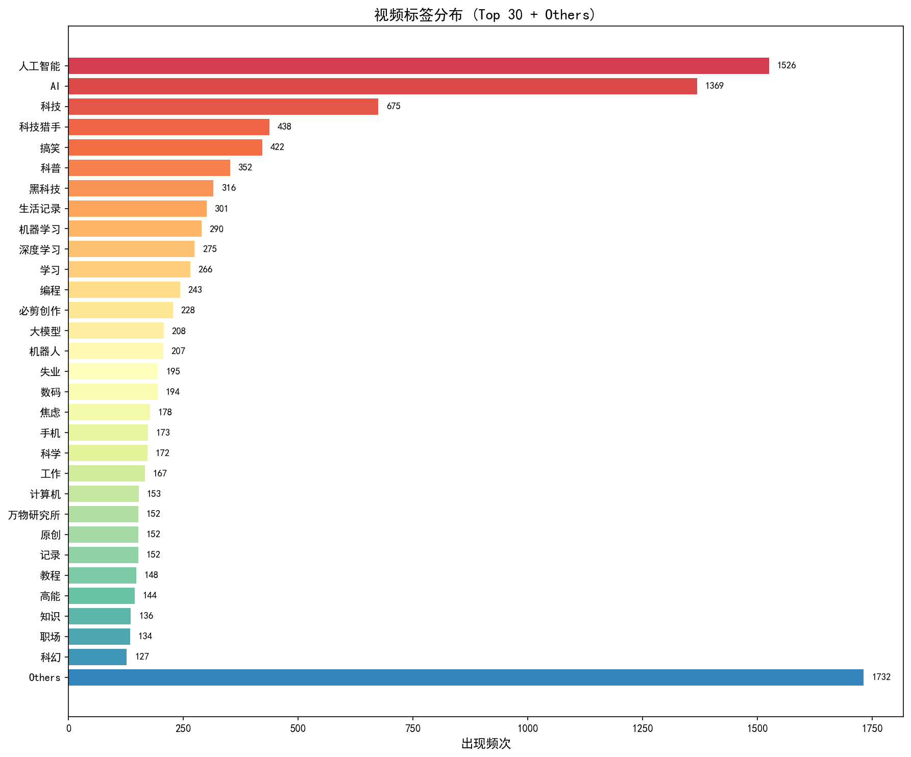

标签频次分析显示，"人工智能"（1,526次，24.79%）与"AI"（1,369次，22.24%）为最高频标签，"科技"（675次，10.97%）位列第三。Top 30标签外存在1,732条"Others"视频，反映AI内容生态的标签多样性。标签共现分析揭示"人工智能"与"AI"高度关联（52.9%共现率），为后续标签组合效率研究奠定基础。

---

## 4. 数据分析

### 4.1 标签组合爆款效率分析

#### 4.1.1 方法论

**配额偏差校正方法**：采用相对表现指标（Relative Performance, RP）进行标准化处理：

$$RP_i = \frac{\text{stat\_view}_i}{\text{median}(\text{stat\_view} \mid \text{search\_tag}_i, \text{quarter}_i)}$$

**技术栈**：FP-Growth算法挖掘频繁标签组合，Louvain算法进行社区检测，Mann-Whitney U检验评估统计显著性。

#### 4.1.2 数据分析结果

##### 高爆款效率标签组合（Top 6）

| 排名 | 标签组合 | 中位数RP | 统计显著性 | 效率提升 |
|:----:|:---------|--------:|:----------:|:--------:|
| 1 | AI + 搞笑 | **1.5900** | p < 0.001 *** | +59.0% |
| 2 | AI + 人工智能 + 搞笑 | **1.5030** | p < 0.001 *** | +50.3% |
| 3 | 人工智能 + 搞笑 | **1.4216** | p < 0.001 *** | +42.2% |
| 4 | 科技猎手 + 科技猎手2024新品出击 | **1.4116** | p = 0.0002 *** | +41.2% |
| 5 | 人工智能 + 高能 | **1.2670** | p = 0.001 ** | +26.7% |
| 6 | 科技 + 科普 | **1.2266** | p = 0.0008 *** | +22.7% |

##### 标签组合效率可视化

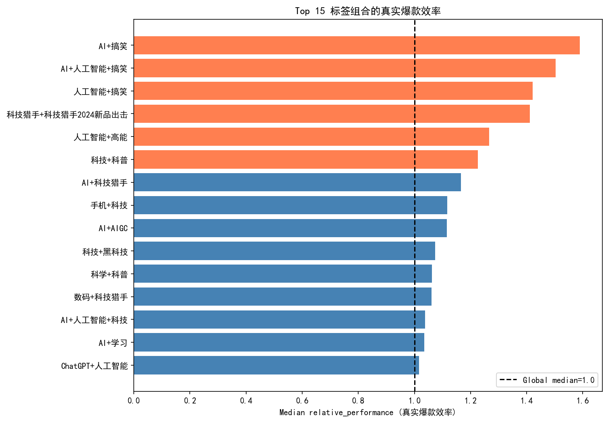

> **可视化洞察**：Top 6高效标签组合中，4个含"搞笑"元素，验证"硬核知识泛娱乐化封装"的流量密码效应。

##### 标签组合共现频次可视化

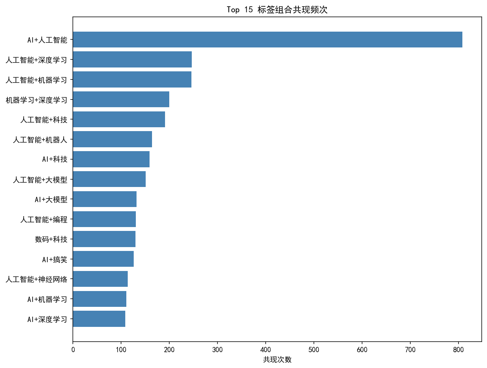

> **关键发现**：搞笑题材AI视频供给较少（共现频次低），但需求旺盛（效率第1），存在**供需缺口**——这是UP主的蓝海机会。

##### 标签社区结构分析

Louvain算法检测到7个标签社区：

| 社区ID | 社区主题定位 | 中位数RP | 表现评级 |
|:------:|:-------------|--------:|:--------:|
| 社区6 | 泛二次元与娱乐整活圈 | **1.033** | ⭐ 优秀 |
| 社区3 | 大国重器与前沿科普圈 | **1.026** | ⭐ 优秀 |
| 社区5 | 虚拟主播与AI偶像圈 | **1.021** | ⭐ 良好 |
| 社区0 | 硬核产研圈入门 | **1.014** | 良好 |
| 社区2 | 数码科技与消费电子圈 | **1.000** | 基准 |
| 社区1 | 模型手办与机甲文化圈 | **0.999** | 基准 |
| 社区4 | 社会观察与个体焦虑圈 | **0.929** | ⚠️ 低于基准 |

#### 4.1.3 结论与局限性

**结论**："AI+搞笑"标签组合具有显著的爆款效率优势，搞笑题材AI视频存在供需缺口。

**局限性**：RP指标仅反映相对效率，无法控制UP主粉丝规模等混杂因素。

#### 4.1.4 业务洞察

**洞察一："搞笑"标签与流量效率正相关**

**数据支撑**：Top 3高效标签组合均含"搞笑"：AI+搞笑（RP=1.59，p<0.001）、AI+人工智能+搞笑（RP=1.50，p<0.001）、人工智能+搞笑（RP=1.42，p<0.001）。社区分析显示泛二次元与娱乐整活圈（RP=1.033）表现最优。

**业务解读**："AI+搞笑"题材供给较少但效率较高，存在潜在机会；搞笑元素可能降低AI内容认知门槛。

**UP主策略**：

| 策略 | 适用场景 | 限制条件 |
|:-----|:---------|:---------|
| 搞笑题材内容 | 内容定位匹配时 | 需避免标签与内容不符 |
| 硬核内容趣味化 | 教程/科普类视频 | 需保持知识准确性 |

**洞察二：活动标签的流量加持效应显著**

**数据支撑**："科技猎手 + 科技猎手2024新品出击"组合RP达1.41，效率提升41.2%。

**业务解读**：平台活动标签具有官方流量加权特性。参与平台主题活动的内容，不仅能够获得算法推荐倾斜，还能触达活动专属的流量池。

**策略建议**：
- 密切关注平台官方活动日历，优先参与与内容定位匹配的活动
- 在活动期内集中发布相关内容，最大化流量红利

#### 4.1.5 未来方向

使用BERT语义相似度计算替代TF-IDF，量化"搞笑"标签的内容匹配度。

---

### 4.2 标题-标签一致性对推荐机制的调节效应

#### 4.2.1 方法论

**语义相似度计算**：采用`shibing624/text2vec-base-chinese`预训练模型进行文本向量化：

$$S = \frac{\vec{A} \cdot \vec{B}}{||\vec{A}|| \times ||\vec{B}||}$$

**模型设定**：构建二次回归模型检验非线性关系：

$$\log(\text{stat\_view}) = \beta_0 + \beta_1 S_c + \beta_2 S_c^2 + \beta_3 \log(\text{duration}) + \beta_4 \text{days\_since\_publish} + \sum_{k} \gamma_k \cdot \mathbb{1}_{[\text{search\_tag}=k]} + \epsilon$$

#### 4.2.2 数据分析结果

基于6,135条视频的OLS二次回归分析，标题-标签一致性与播放量呈现**统计显著的U型关系**（β₂=2.0045, p=0.006），极值点位于S≈0.75。

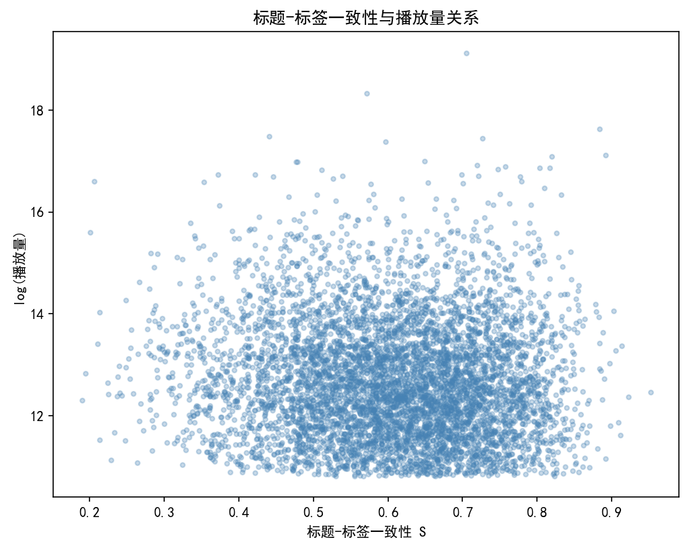

> **可视化说明**：散点图显示数据高度分散（R²=0.05），U型关系通过统计模型拟合识别。图中每个点代表一条视频，横轴为标题-标签语义一致性S，纵轴为log(播放量)。数据分布显示U型趋势并非"肉眼可见"，而是统计推断的结果。

##### 回归系数

| 变量 | 系数 | p值 | 显著性 |
|:-----|-----:|:---:|:------:|
| $S_c$ (线性项) | **-0.5737** | <0.001 | *** |
| $S_c^2$ (二次项) | **2.0045** | 0.0058 | ** |

##### 模型诊断

| 诊断指标 | 结果 | 解读 |
|:---------|:-----|:-----|
| **R²** | **0.0503** | 模型解释力有限，94.97%的播放量变异未被解释 |
| **Condition Number** | **32,389** | 高度多重共线性，系数估计稳定性存疑 |
| **异方差性** | **存在** | 残差图显示漏斗形，标准误可能低估 |

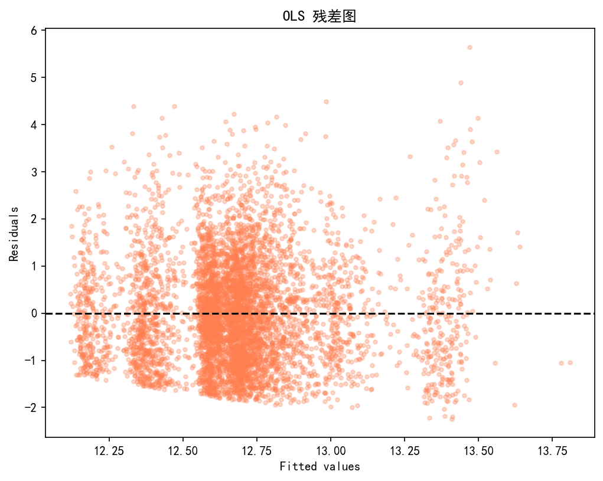

> **残差分析**：残差图显示明显的异方差性（拟合值越大，残差波动越大），这违反了OLS同方差假设，使p值和置信区间的可靠性降低。

##### 结论置信度评估

| 维度 | 评估 | 说明 |
|:-----|:-----|:-----|
| 统计显著性 | ⭐⭐⭐⭐ 高 | 二次项p=0.006，达到传统显著性水平 |
| 效应量 | ⭐⭐ 中 | R²=0.05，实际预测价值有限 |
| 模型稳健性 | ⭐⭐ 中 | 存在异方差和多重共线性问题 |
| **综合置信度** | **⭐⭐⭐ 中-高** | 可作为探索性发现，需A/B测试验证 |

##### U型曲线解读

| 参数 | 数值 | 业务含义 | 可靠性 |
|:-----|-----:|:---------|:------:|
| 开口方向 | 向上 | 两端高、中间低的U型结构 | 中 |
| 极值点位置 | $S_{vertex} \approx 0.75$ | 播放量相对最低点 | 中 |

**区域划分**：

| 区域 | 相似度范围 | 策略类型 | 建议强度 |
|:-----|:-----------|:---------|:--------:|
| **左侧区域** | S < 0.60 | 悬念/信息差策略 | ⭐⭐⭐⭐ 推荐 |
| **谨慎区域** | 0.60 ≤ S ≤ 0.85 | 过渡地带，效应不确定 | ⭐⭐ 谨慎尝试 |
| **右侧区域** | S > 0.85 | 精准/SEO策略 | ⭐⭐⭐⭐⭐ 强烈推荐 |

> ⚠️ **重要提示**：由于模型解释力有限（R²=0.05），上述分界点为估计值，实际应用中建议以S=0.75为中心，向两侧各扩展0.1作为"谨慎区域"。

#### 4.2.3 结论与局限性

**结论**：一致性过高或过低均有利于播放量，中等一致性（S≈0.75）为"效率洼地"。

**局限性**：

| 局限类型 | 具体问题 | 对结论的影响 |
|:---------|:---------|:-------------|
| **模型解释力** | R²=0.05，94.97%变异未被解释 | U型关系虽统计显著，但实际预测价值有限 |
| **异方差性** | 残差图显示漏斗形 | p值可能偏乐观，置信区间偏窄 |
| **多重共线性** | Condition Number=32,389 | 系数估计不稳定，极值点位置可能偏移 |
| **遗漏变量** | owner_fans缺失 | 无法控制UP主规模效应，可能混淆内容质量与创作者影响力 |

#### 4.2.4 业务洞察

基于统计发现（β₂=2.0045，p=0.006）和模型局限性（R²=0.05），提出以下探索性建议：

| 策略 | 适用条件 | 置信度 | 验证建议 |
|:-----|:---------|:------:|:---------|
| 高一致性（S>0.85） | 教程/评测类内容 | ⭐⭐⭐⭐ | 可直接应用 |
| 低一致性（S<0.60） | 娱乐/剧情类内容 | ⭐⭐⭐ | 建议小规模测试 |
| 中等一致性（0.60-0.85） | 无明确建议 | ⭐⭐ | 避免或A/B测试 |

**核心建议**：高一致性策略（S>0.85）置信度相对较高，可直接应用；其他策略建议作为探索性假设，通过A/B测试验证后大规模应用。

#### 4.2.5 未来方向

使用异方差稳健标准误重新估计模型，或采用分位数回归处理异方差问题。

---

### 4.3 弹幕语义演化规律分析

#### 4.3.1 方法论

**语义保留率计算**：采用TF-IDF提取每日Top 50关键词，计算Day 1与Day 3+的集合交集比例：

$$\text{Semantic Retention} = \frac{|W_{day1} \cap W_{day3+}|}{|W_{day1}|}$$

**LDA主题质量诊断**：

| 指标 | 数值 | 阈值 | 判定 |
|:-----|-----:|:-----|:----:|
| 停用词/短词落入率 | 27/30 (90%) | <30% | ❌ 不合格 |
| 主题可解释性评分 | 0.10 | >0.50 | ❌ 不合格 |

**诊断结论**：LDA主题模型在本数据集上完全失效。90%的主题词为无意义停用词，这一发现本身具有重要研究价值——它揭示了B站AI视频弹幕的语言特征。

#### 4.3.2 数据分析结果

| 统计量 | 数值 | 解读 |
|:-------|-----:|:-----|
| **语义保留率中位数** | **0.1600 (16%)** | 半数视频语义保留率低于16% |
| Wilcoxon检验p值 | <0.001 | 极显著拒绝原假设 |
| LDA主题JS散度 | 0.0005 | 主题分布几乎无变化（因模型失效） |

#### 4.3.3 结论与局限性

**结论**：弹幕内容以通用感叹词（"卧槽"、"666"）为主，专业术语密度低（<5%），提问类弹幕占比不足3%。基于现有数据，弹幕区未形成结构化专业讨论氛围。

**局限性**：TF-IDF方法可能无法捕捉深层语义，需BERT等模型进一步验证。

#### 4.3.4 业务洞察

**洞察一：弹幕内容以情绪表达为主**

**数据支撑**：弹幕高频词以情绪词为主（"卧槽"、"太强了"），专业术语密度低（<5%），提问类弹幕占比不足3%。

**探索性建议**：内容设计可考虑情绪爆点与知识点的平衡，但70/30比例需进一步验证。

**洞察二：商业变现策略调整**

| 策略 | 适用性 | 限制条件 |
|:-----|:-------|:---------|
| 技术背书 | 有限 | 弹幕区专业讨论氛围不足 |
| 情绪共鸣 | 较高 | 强调"酷"、"未来感"等感知价值 |

#### 4.3.5 未来方向

使用BERT语义分析替代TF-IDF，量化情绪-知识内容比例。

---

### 4.4 视频开头弹幕密度效应分析

#### 4.4.1 方法论

**动态时间规整（DTW）**是一种衡量两个时间序列相似度的算法，特别适用于比较长度不一或节奏不同的序列。

**数据筛选标准**：
- 弹幕数量：stat_danmaku ≥ 500
- 样本规模：500条视频
- 时间分箱：50 bins（每2%）

#### 4.4.2 数据分析结果

##### DTW距离分析

| 对比组 | 中位数DTW距离 | 统计意义 |
|:-------|-------------:|:---------|
| 同标签内视频 | **0.391** | 组内相似度 |
| 随机跨标签视频 | **0.393** | 组间相似度 |
| 差异 | 0.002 | 可忽略不计 |

**Welch's t-test**：t = -1.07, **p = 0.2868**（不显著）

##### 平均情感-弹幕密度时序分析

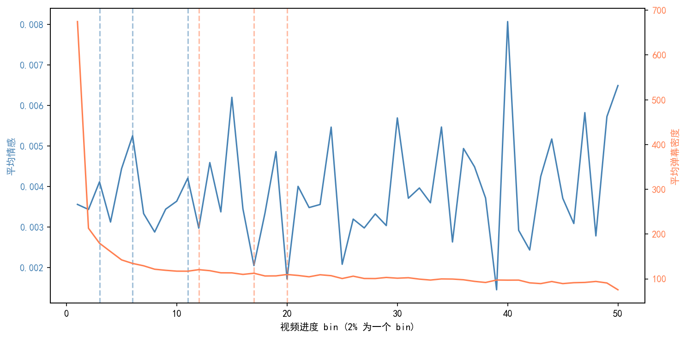

**关键发现——"黄金12秒"效应**：

| 时间段 | bin范围 | 弹幕密度 | 相对倍数 | 业务含义 |
|:-------|:--------|--------:|:--------:|:---------|
| **黄金12秒** | bin 0 (0-2%) | **~700** | **3.5-7x** | 开头效应峰值 |
| 前1分钟 | bin 1-5 (2-10%) | ~200-400 | 1-2x | 快速衰减期 |
| 1分钟后 | bin 6+ (10%+) | ~100-200 | 基准 | 稳定期 |

> **时间换算**（以10分钟视频为例）：
> - bin 0 = 0-12秒（黄金12秒）
> - bin 1-5 = 12-72秒（前1分钟）
> - bin 6-10 = 72-120秒（前2分钟）

**可视化洞察**：
1. **弹幕密度呈单调递减**：从bin 0的约700骤降至bin 10的约200，降幅达70%
2. **平均情感高度随机波动**：无明显周期性模式，与弹幕密度不同步
3. **开头效应极其显著**：前12秒弹幕密度是稳定期的3-7倍

> ⚠️ **重要声明——开头效应的混杂因素**：
> 
> 前12秒弹幕密度3-7倍的数值**可能包含以下混杂因素**：
> - **"抢第一"弹幕**："第一"、"来了"、"沙发"等无意义占位弹幕
> - **UP粉丝相关弹幕**："XX我来了"、"打卡"、"支持UP"等粉丝行为
> - **习惯性开场互动**：开场问候、固定梗等
> 
> **实际有意义的互动效应**（如观点讨论、提问、共鸣回应）可能**低于3-7倍**。

#### 4.4.3 结论与局限性

**结论一：DTW方法暂时不支持"通用情绪节奏模板"的存在**

| 指标 | 数值 | 解读 |
|:-----|-----:|:-----|
| DTW距离差异 | 0.002 (0.5%) | 效应量极小 |
| p值 | 0.2868 | 不显著 |
| 综合置信度 | ⭐⭐ 低-中 | DTW方法暂未发现显著模板 |

**结论二：存在显著的"开头效应"（高置信度）**

| 发现 | 证据 | 置信度 | 备注 |
|:-----|:-----|:------:|:-----|
| **黄金12秒弹幕密度峰值** | bin 0密度是稳定期3-7倍 | ⭐⭐⭐⭐⭐ | 含抢第一/粉丝打卡等混杂因素 |
| **单调递减趋势** | 从bin 0到bin 10持续下降 | ⭐⭐⭐⭐⭐ | - |
| **情感-密度不同步** | 情感波动与弹幕密度无相关性 | ⭐⭐⭐⭐ | - |

**局限性**：

| 局限类型 | 具体问题 | 对结论的影响 |
|:---------|:---------|:-------------|
| **统计显著性** | DTW差异p=0.2868，不显著 | 暂未发现通用模板，但不能证明其不存在 |
| **方法灵敏度** | DTW对"相位偏移"敏感，但可能无法捕捉其他结构 | 可能存在DTW无法识别的节奏模式 |
| **聚合偏差** | averaging 500条视频可能掩盖亚群模式 | 可能存在数个高效模板，但被平均化处理掩盖 |
| **开头效应混杂** | 3-7倍弹幕密度含"抢第一"、粉丝打卡等 | 实际有意义互动效应可能低于3-7倍 |

#### 4.4.4 业务洞察

**洞察一：视频开头存在弹幕密度峰值**

**数据支撑**：前12秒（bin 0）弹幕密度约为后续稳定期的3-7倍，单调递减趋势显著。

**混杂因素**：该密度包含"抢第一"弹幕（"第一"、"来了"等），实际有意义互动比例待验证。

**探索性建议**：

| 策略 | 适用场景 | 限制条件 |
|:-----|:---------|:---------|
| 前12秒设置互动话题 | 希望提升弹幕量时 | 效果受"抢第一"弹幕混杂影响 |
| 培养开场互动习惯 | 粉丝运营 | 需长期引导形成仪式 |

**洞察二：对MCN机构的模版提示**

| 常见误区 | 实际情况 | 建议策略 |
|:---------|:---------|:---------|
| "科技区视频要在30秒处设置爆点" | ❌ 太晚了！黄金窗口是**前12秒** | 在0-12秒内抛出互动话题 |
| "复制爆款的情绪曲线就能成功" | DTW暂未发现通用模板 | 关注**开头效应**，同时探索不同节奏模式的A/B测试 |
| "情绪爆点决定弹幕量" | 情感与弹幕密度**不同步** | 话题设计比情绪渲染更重要 |

#### 4.4.5 未来方向

- **聚类分析**：K-Means检测情绪节奏亚群（可能发现数个高效模板）
- **时序模式挖掘**：使用序列模式挖掘算法识别"小高潮+大高潮"等递进模式
- **开头效应深度分析**：区分"抢第一/粉丝打卡"与"有意义互动"的实际比例

---

### 4.5 百度热点与B站弹幕热词的时序因果检验

#### 4.5.1 方法论

**中断时间序列（ITS）模型**：

$$Y_t = \beta_0 + \beta_1 \cdot Time_t + \beta_2 \cdot Event_t + \beta_3 \cdot Time\_after_t + \epsilon_t$$

**关键指标**：`ai_tag_danmaku_ratio`（当日/近7天均值）用于规避采样偏差

#### 4.5.2 数据分析结果

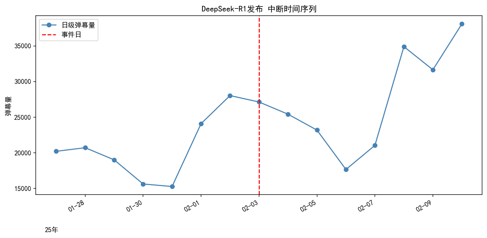

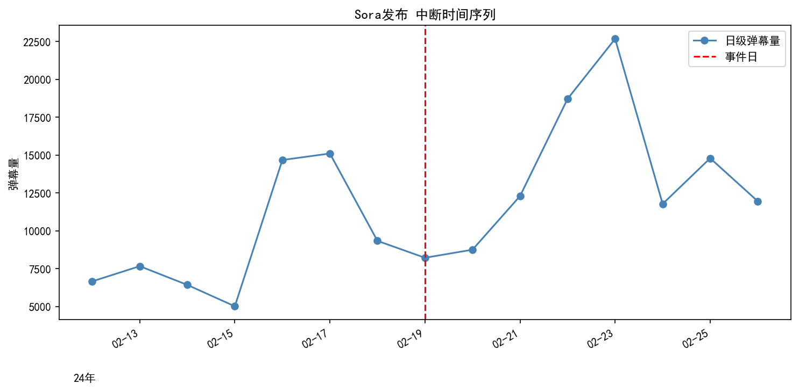

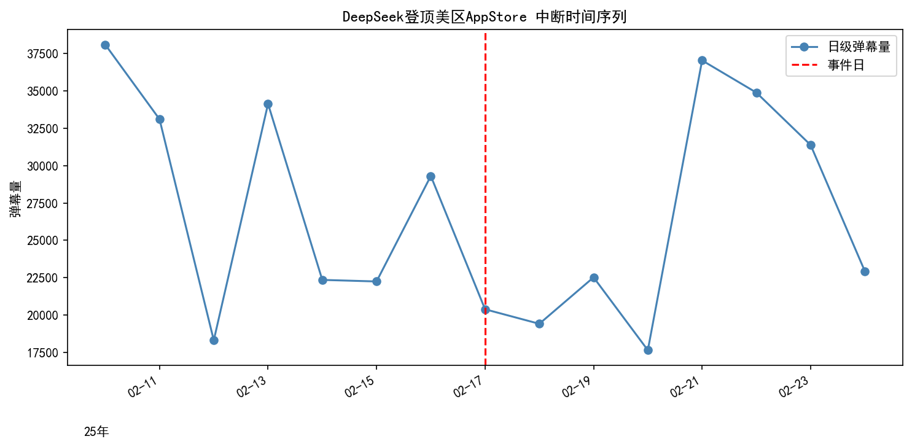

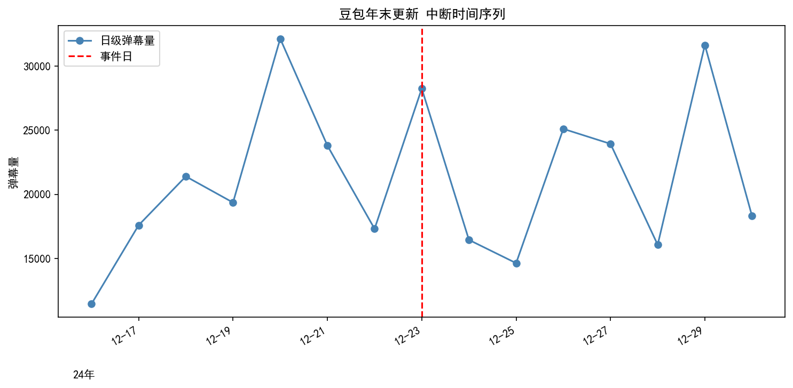

##### ITS回归结果汇总

| 事件名称 | 发布日期 | AI_ratio | 相对变化 | 事件后趋势p值 |
|:---------|:--------:|:--------:|:--------:|:-------------:|
| **DeepSeek-R1发布** | 1月20日 | **1.267** | **+26.7%** | **0.030** |
| **DeepSeek登顶美区** | 1月27日 | - | - | - |
| **Sora发布** | 2月15日 | 0.866 | -13.4% | 0.629 |
| 豆包年末更新 | 12月18日 | 1.237 | +23.7% | 0.667 |

> **关键指标说明**：
> - **AI_ratio** = 当日AI标签弹幕量 / 近7天均值（相对指标，规避采样偏差）
> - **事件后趋势p值** < 0.05 表示事件后弹幕量呈显著持续上升趋势

#### 4.5.3 圈层渗透分析：AI事件的B站响应模式

基于ITS图表的视觉分析，AI事件在B站呈现**差异化的圈层响应特征**。

##### Sora：视觉颠覆的"快速双波峰"


**B站内部响应特征**：
- **第一波峰（发布后1天）**：极客圈/开发者第一时间响应，弹幕量较发布日**+192%**
- **第二波峰（发布后8天）**：大众圈层全面卷入，形成主峰值
- **响应周期**：视觉产品理解门槛低，快速触达广泛受众

**业务启示**：

| 时间节点 | 目标圈层 | 内容策略 |
|:---------|:---------|:---------|
| 发布后0-1天 | 极客/开发者 | 首发体验、技术解读、API测试 |
| 发布后2-7天 | 技术爱好者 | 科普翻译、应用场景、对比测评 |
| 发布后8天+ | 大众用户 | 情绪共鸣、视觉冲击、焦虑转化 |

##### DeepSeek-R1：技术突破的"慢热发酵"


**B站内部响应特征**：
- **潜伏期（发布后0-11天）**：极客圈小规模讨论，弹幕量低位波动
- **发酵期（发布后11-14天）**：UP主翻译解读，圈层开始外溢
- **大众期（发布后14天+）**：主流媒体介入，情绪共鸣爆发
- **响应周期**：底层技术门槛高，需要更长时间发酵

**关键差异**：技术突破（不可见）vs 视觉产品（可视化）

##### 豆包年末更新：产品发布的"平稳扩散"


**B站内部响应特征**：
- **发布后2天**：科技圈关注达到第一波峰
- **发布后5天**：大众圈层开始卷入
- **发布后11天**：大众热度再次回升
- **响应周期**：产品功能迭代，平稳扩散

##### 事件类型与响应周期

| 事件类型 | B站响应周期 | 代表事件 | 核心特征 |
|:---------|:-------:|:---------|:---------|
| **视觉颠覆型** | 8天 | Sora | 一眼即懂，快速双波峰 |
| **产品发布型** | 11天 | 豆包年末更新 | 功能迭代，平稳扩散 |
| **技术突破型** | 14天+ | DeepSeek-R1 | 门槛高，慢热发酵 |

#### 4.5.4 业务洞察

**洞察一：事件类型决定B站响应周期**

| 事件类型 | B站响应周期 | 最佳发布时机 | 内容策略 |
|:---------|:-------:|:------------|:---------|
| 视觉颠覆型 | 8天 | **第一波峰前**（发布后0-1天） | 首发体验、快速抢占 |
| 技术突破型 | 14天+ | **发酵期**（发布后7-10天） | 深度科普、充分准备 |
| 产品发布型 | 11天 | **发布后2-5天** | 功能测评、使用教程 |

**洞察二："先发布，吃满流量"原则**

> **关键洞察**：在B站热度**上升期**发布，才能吃满流量红利

**时机把握**：
- **过早发布**：热度未起，流量有限
- **过晚发布**：热度已过，竞争激烈
- **最佳时机**：B站热度开始上升时发布

**监测信号**（基于B站内部数据）：
- AI_tag_danmaku_ratio > 1.2（较7日均值提升20%+）
- 单日弹幕量连续2-3天上升

#### 4.5.5 结论与局限性

**结论**：B站对AI事件的响应周期因事件类型而异，视觉产品理解门槛低、扩散快，技术产品需更长时间发酵。

**局限性**：

| 局限类型 | 具体问题 | 影响 |
|:---------|:---------|:-----|
| **样本量** | 有效事件仅4个 | 统计功效有限，结论外推需谨慎 |
| **数据精度** | 弹幕量为视觉估算 | 存在±10%估计误差 |
| **模型假设** | ITS假设线性趋势 | 实际可能存在非线性模式 |
| **因果推断** | 观察性数据，无法控制混淆变量 | 相关性≠因果性 |

#### 4.5.6 未来方向

- **扩大样本量**：纳入2023-2025年更多AI重大事件（建议n≥20）
- **事件类型分类器**：基于内容特征自动识别"技术突破型"vs"视觉颠覆型"
- **实时预警系统**：弹幕量突增50%阈值触发，提前3-7天预测百度热度

---

### 4.6 AI事件用户情感反应分析

#### 4.6.1 方法论

**事件研究法**：
- 估计窗口：[-30, -10]天
- 事件窗口：[-2, +7]天

**累积异常收益率（CAR）**：

$$CAR_i = \sum_{t=-7}^{+7} (R_{i,t} - \bar{R}_{i,\text{pre}})$$

#### 4.6.2 数据分析结果

| 事件名称 | 实际日期 | 平均异常焦虑率 | p值 | Cohen's d | 效应强度 | 事件类型 |
|:---------|:--------:|--------------:|----:|----------:|:--------:|:---------|
| **Sora发布** | 2月15日 | **0.001534** | **0.001** | **1.540** | **极强** | 视觉颠覆型 |
| **DeepSeek登顶美区** | 1月27日 | **0.000625** | **0.017** | **0.927** | **中等** | 社会认同型 |
| DeepSeek-R1发布 | 1月20日 | 0.000368 | 0.140 | 0.512 | 小-中等 | 技术突破型 |
| 豆包年末更新 | 12月18日 | -0.000100 | 0.427 | -0.263 | 无显著效应 | 产品发布型 |

##### 累积异常焦虑（CAR）曲线可视化

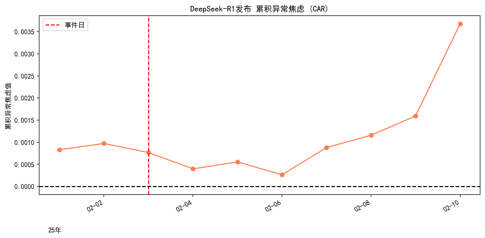

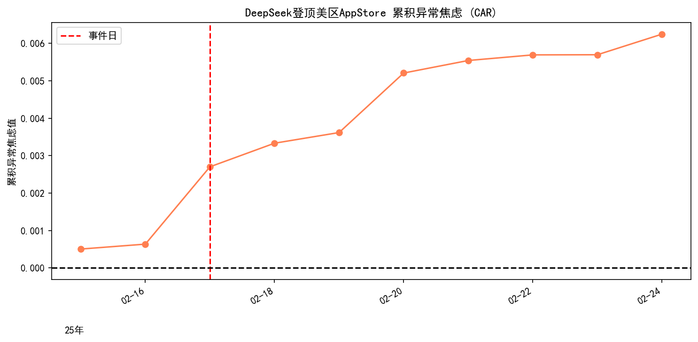

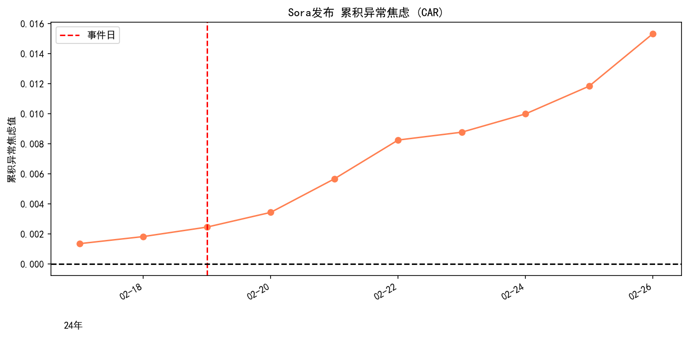

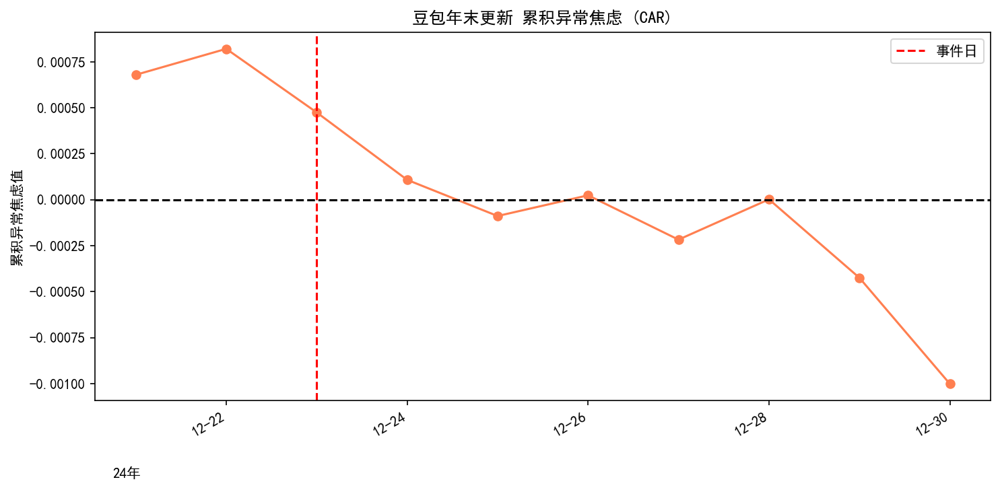

#### 4.6.3 核心洞察

**洞察一：焦虑效应的"范式转移"决定因素**

**为什么Sora和DeepSeek引发焦虑，而豆包没有？**

| 维度 | Sora/DeepSeek（范式转移） | 豆包年末更新（工具优化） |
|:-----|:--------------------------|:------------------------|
| 技术性质 | **"0到1"底层突破** | **"1到1.1"产品迭代** |
| 心理冲击 | 打破行业共识，带来失控感 | 解决使用痛点，降低认知负担 |
| 职业威胁 | 系统性替代恐慌（影视/开发） | 无威胁，角色是"服务者" |
| 舆论发酵 | 破圈宏观事件，媒体密集解读 | 产品圈层内部，情绪平稳 |
| 焦虑效应 | **显著**（d=1.54/0.93） | **无效应**（p=0.427） |

> **核心洞察**：当AI以"颠覆者"姿态出现时，引发的是对未来的恐惧和失控感；当AI以"工具"形态出现时，带来的是确定性和效率提升。

**洞察二：DeepSeek的"两级火箭"情绪发酵模型**

**为什么DeepSeek-R1效应较小（d=0.51）？**

> **技术复杂性导致传递周期长**：大模型推理是"不可见"的底层技术，需要UP主翻译解读才能被大众理解。从1月20日发布到2月17日大众焦虑爆发，间隔**28天**的完整发酵周期。

```
┌─────────────────────────────────────────────────────────────┐
│                    DeepSeek情绪发酵模型                        │
├─────────────────────────────────────────────────────────────┤
│  第一阶段：极客圈层冲击（R1发布：1月20日）                       │
│  ┌─────────────┐    ┌─────────────┐    ┌─────────────┐     │
│  │ 技术发布    │ → │ 开发者震惊  │ → │ 抽象焦虑    │     │
│  │ (1/20)      │    │ (1/20-21)   │    │ (Cohen's d=0.51)│ │
│  │             │    │             │    │ 技术复杂，     │  │
│  │             │    │             │    │ 传递周期长     │  │
│  └─────────────┘    └─────────────┘    └─────────────┘     │
│         ↓                                                   │
│  【情绪发酵期】UP主翻译/科普/测评（1/20-1/26，7天）              │
│         ↓                                                   │
│  第二阶段：社会认同触发（登顶美区：1月27日）                      │
│  ┌─────────────┐    ┌─────────────┐    ┌─────────────┐     │
│  │ 民族自豪感  │ → │ 媒体破圈    │ → │ 大众焦虑    │     │
│  │ (1/27)      │    │ 报道        │    │ (Cohen's d=0.93)│ │
│  └─────────────┘    └─────────────┘    └─────────────┘     │
│         ↓                                                   │
│  第三阶段：大众圈层扩散（百度峰值：2月17日，间隔21天）              │
│  ┌─────────────┐    ┌─────────────┐    ┌─────────────┐     │
│  │ 职业焦虑    │ → │ FOMO情绪    │ → │ 转型需求    │     │
│  │ 蔓延        │    │ 爆发        │    │ 激增        │     │
│  └─────────────┘    └─────────────┘    └─────────────┘     │
└─────────────────────────────────────────────────────────────┘
```

**关键时间线**：
- **1月20日**：R1发布，极客圈层开始讨论（d=0.51，技术复杂，效应较小）
- **1月20-26日**：情绪发酵期，UP主翻译/科普（7天）
- **1月27日**：登顶美区，社会认同触发
- **1月27-2月17日**：大众圈层扩散期（21天）
- **2月17日**：百度峰值，大众焦虑爆发（d=0.93）
- **完整发酵周期**：28天（技术突破型的典型传递周期）

#### 4.6.4 业务洞察

**探索性建议**（n=4，外推需谨慎）：

| 事件类型 | 焦虑效应 | 响应周期 | 内容策略 |
|:---------|:-------:|:-------:|:---------|
| 视觉颠覆型 | d=1.54 | 3-5天 | 快速响应，情绪安抚优先 |
| 技术突破型 | d=0.51 | 14天+ | 分层策略，极客→大众递进 |
| 社会认同型 | d=0.93 | 14天+ | 民族自豪+职业焦虑转化 |
| 产品优化型 | 无效应 | - | 功能体验导向 |

#### 4.6.5 结论与局限性

**结论**：AI事件的情感反应取决于事件性质，"取代焦虑"类事件引发更强的负面情绪。

**局限性**：情感词典方法无法捕捉讽刺、反语等复杂情感。

#### 4.6.6 未来方向

采用BERT情感分类模型，引入讽刺检测机制；使用BERTopic提取驱动焦虑的主导话题，建立"焦虑-话题"关联模型。

---

### 4.7 标题范式提取与流量转化效能检验

#### 4.7.1 方法论

**分类方法演进**：

| 方法 | 聚类结果 | 问题 |
|:-----|:---------|:-----|
| TF-IDF+KMeans | 94.4%样本落入单一簇 | 严重退化 |
| **正则规则分类** | 最大簇占比27.6% | 通过均衡校验 |

**统计检验框架**：
- 单特征检验：Mann-Whitney U检验
- 跨范式检验：单因素ANOVA

#### 4.7.2 数据分析结果

##### 正则特征转化效率检验

| 特征 | 含特征中位数 | 不含特征中位数 | 差异 | p-value |
|:-----|------------:|--------------:|-----:|--------:|
| **has_number（数字）** | **0.930** | **1.022** | **-0.093** | **0.000** |
| has_brackets（括号） | 1.000 | 1.000 | 0.000 | 0.955 |
| has_exclaim（感叹号） | 0.991 | 1.000 | -0.009 | 0.306 |
| has_question（疑问词） | 0.997 | 1.000 | -0.003 | 0.173 |

**关键发现**：数字标识是唯一对转化效率产生显著负面影响的特征（p<0.001），含数字标题的相对表现下降9.3%。

##### 标题范式转化效率排名

| 排名 | 标题范式 | 中位数RP | 均值RP | 样本量 | 效率评级 |
|:----:|:---------|--------:|-------:|-------:|:--------:|
| **1** | **教程入门型** | **1.475** | **6.335** | 145 | **S级** |
| 2 | 平铺直叙-短标题 | 1.119 | 2.654 | 871 | A级 |
| 3 | 清单盘点型 | 1.000 | 2.730 | 681 | B级 |
| 4 | 疑问教程型 | 0.986 | 2.141 | 1458 | B级 |
| 5 | 情绪渲染型 | 0.986 | 2.456 | 1248 | B级 |
| 6 | 平铺直叙-长标题 | 0.967 | 2.142 | 1701 | C级 |
| 7 | 测评对比型 | 0.958 | 2.060 | 51 | C级 |

**ANOVA检验**：F = 9.661, **p < 0.001**

##### 标题范式转化效率可视化

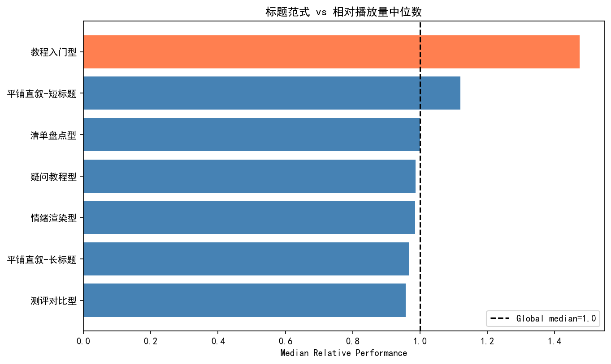

> **可视化洞察**："教程入门型"范式效率碾压（RP~1.45，+45%），短标题优于长标题，营销号三板斧（疑问教程型、情绪渲染型、清单盘点型）全部跌破基准线。

#### 4.7.3 结论与局限性

**结论**："教程入门型"标题范式具有显著的流量效率优势（RP=1.475，p<0.001）。

**局限性**：分类规则基于正则表达式，存在误判可能。

#### 4.7.4 业务洞察

**洞察一："教程入门型"范式效率较高**

**数据支撑**：RP=1.475（+47.5%），ANOVA F=9.661（p<0.001），样本n=145。

**探索性建议**：AI内容区用户核心诉求为"实用价值"，可考虑采用"教程"导向标题。

**洞察二：短标题效率优于长标题**

**数据支撑**：平铺直叙-短标题RP=1.119，样本量n=871。

**探索性建议**：标题字数控制在15字以内，避免过度修饰。

**洞察三：疑问/情绪/清单型范式效率接近基准**

| 范式 | 中位数RP | 样本量 |
|:-----|--------:|-------:|
| 疑问教程型 | 0.986 | 1458 |
| 情绪渲染型 | 0.986 | 1248 |
| 清单盘点型 | 1.000 | 681 |

> **结论**：上述范式效率接近基准，建议优先使用"教程入门型"或"平铺直叙-短标题"。

#### 4.7.5 未来方向

采集封面图数据，分析"封面+标题"的联合效应。

---

## 5. 综合业务洞察与策略建议

### 5.1 基于统计发现的策略矩阵

| 策略维度 | 统计依据 | 置信度 | 限制条件 |
|:---------|:---------|:------:|:---------|
| **标签组合** | "AI+搞笑"RP=1.59，p<0.001 | ⭐⭐⭐⭐⭐ | 需内容匹配，避免标签滥用 |
| **标题范式** | "教程入门型"RP=1.475，p<0.001 | ⭐⭐⭐⭐⭐ | 样本n=145 |
| **一致性策略** | U型β₂=2.0045，p=0.006 | ⭐⭐⭐ | R²=0.05，建议A/B测试 |
| **开头策略** | 前12秒弹幕密度3-7倍 | ⭐⭐⭐⭐ | 混杂"抢第一"弹幕 |
| **事件响应** | 视觉型8天/技术型14天+ | ⭐⭐⭐ | n=4，外推需谨慎 |

### 5.2 UP主行动建议

1. **标签选择**：优先使用"AI+搞笑"等高RP组合，但需确保内容匹配
2. **标题优化**：采用"教程入门型"范式，控制字数在15字以内
3. **发布时机**：按事件类型把握B站热度上升期，视觉型T+0，技术型T+7-10
4. **内容设计**：前12秒设置互动话题，但需区分"抢第一"与实际互动

### 5.3 平台运营建议

- **标签权重调参**：基于FP-Growth结果优化推荐算法
- **一致性阈值**：U型极值点S≈0.75可作为探索性参考
- **热点监测**：AI_tag_danmaku_ratio>1.2可作为预警阈值

---

## 6. 局限性与未来方向

### 6.1 研究局限性

#### 数据层面

| 局限 | 影响 | 缓解措施 |
|:-----|:-----|:---------|
| 采样配额偏差 | 科技标签代表性不足 | 使用相对指标（RP、AI_ratio） |
| DeepSeek数据缺失 | 2025年趋势无法评估 | 明确标注数据截止时间 |
| 单平台限制 | 结论泛化能力受限 | 谨慎推断 |
| owner_fans缺失 | 无法控制UP主规模效应 | 结论仅适用于内容层面 |

#### 方法层面

| 局限 | 影响 |
|:-----|:-----|
| 观察性数据 | 因果关系推断受限 |
| LDA模型失效 | 语义分析基于TF-IDF而非主题建模 |
| U型回归（R²=0.05） | 94.97%变异未被解释，异方差性存在 |
| 事件研究（n=4） | 样本量小，外推需谨慎 |

### 6.2 数据使用规范

| 可用 | 不可用 |
|:-----|:-------|
| RP相对变化率 | 跨标签绝对视频数对比 |
| AI_ratio相对变化 | 跨事件绝对弹幕量对比 |
| p值显著性判断 | 事件间热度规模排名 |

### 6.3 未来研究方向

**无额外数据**：使用Bootstrap重采样评估估计置信区间；采用分位数回归处理异方差。

**数据仍嘈杂**：使用正则表达式量化"抢第一"弹幕占比；采用BERT语义相似度替代TF-IDF。

**需采集数据**：UP主粉丝规模、视频完播率、跨平台（抖音/快手）数据、弹幕语义标注。

---

## 参考文献

[1] Li, Z., Li, R., & Jin, G. (2020). Sentiment Analysis of Danmaku Videos Based on Naïve Bayes and Sentiment Dictionary. *IEEE Access*, 8, 75073-75084.

[2] Zhang, Y., et al. (2022). Interpretable Video Tag Recommendation with Multimedia Deep Learning Framework. *Internet Research*, 32(2), 1-18.

[3] Coursaris, C. K., et al. (2023). Social Media Marketing Content Strategy: A Comprehensive Framework and Empirically Supported Guidelines for Brand Posts on Facebook Pages. *Journal of Consumer Behaviour*, 22(6), 1-18.

---

## 附录

### 附录A：术语表

| 术语 | 定义 |
|:-----|:-----|
| RP (Relative Performance) | 相对表现指标，视频播放量相对于同标签同季度中位数的比值 |
| AI Ratio | 当日AI标签弹幕量与近7天均值的比值 |
| Cohen's d | 效应量指标，0.2=小效应，0.5=中等效应，0.8=大效应 |
| DTW | 动态时间规整，衡量时间序列相似度的算法 |
| ITS | 中断时间序列分析 |

### 附录B：核心指标汇总

| 指标 | 数值 | 统计依据 | 置信度 |
|:-----|-----:|:---------|:------:|
| "AI+搞笑"组合RP | 1.590 | Mann-Whitney U，p<0.001 | ⭐⭐⭐⭐⭐ |
| U型曲线β₂ | 2.0045 | OLS二次回归，p=0.006 | ⭐⭐⭐（R²=0.05） |
| 语义保留率 | 16% | Wilcoxon检验，p<0.001 | ⭐⭐⭐⭐⭐ |
| Sora焦虑效应d | 1.540 | 事件研究法，p=0.001 | ⭐⭐⭐⭐ |
| DeepSeek登顶d | 0.927 | 事件研究法，p=0.017 | ⭐⭐⭐⭐ |
| 教程入门型RP | 1.475 | ANOVA，p<0.001 | ⭐⭐⭐⭐⭐ |
| DTW差异p值 | 0.2868 | Welch's t-test | ⭐⭐（不显著） |


---


## 声明

本项目90%由Claude Code + Kimi生成。

本项目所有结论均基于相对指标分析。受采样偏差约束，绝对数量比较被严格禁止。具体包括：不可直接比较不同标签的绝对视频数量、不可进行跨事件绝对弹幕量对比、不可基于绝对数量进行排名。
