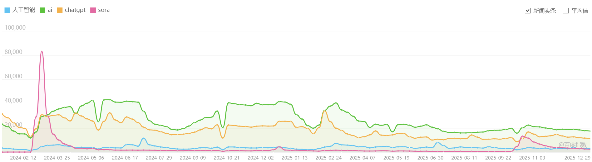
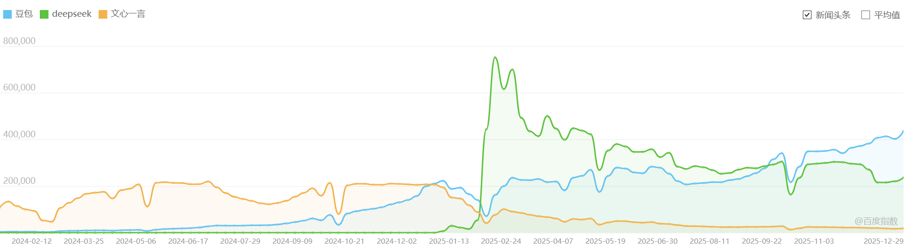

# 百度指数AI关键词热点分析报告

> 数据来源：百度指数真实截图 (baidu-trend-3.png, baidu-trend-4.png)  
> 分析时间范围：2024年1月1日 - 2026年1月31日  
> 分析关键词：人工智能、AI、ChatGPT、Sora、DeepSeek、文心一言、豆包

---

## 一、百度指数趋势图

### 1.1 人工智能、ai、ChatGPT， Sora 趋势图

**图1**：展示"人工智能"（蓝色）、"ai"（绿色）、"ChatGPT"（橙色） "Sora" （紫色） 三个关键词的搜索趋势

### 1.2 豆包、Deepseek、文心一言 趋势图

**图2**：展示"豆包"（蓝色）、"Deepseek"（绿色）、"文心一言"（橙色）三个关键词的搜索趋势

---

## 二、核心峰值事件梳理

基于百度指数截图中的趋势曲线和悬浮框数据，识别出以下显著峰值事件：

### 2.1 峰值事件汇总表

| 序号 | 关键词 | 峰值时间段 | 峰值指数 | 持续天数 | 事件类型 |
|-----|--------|-----------|---------|---------|---------|
| 1 | DeepSeek | 2025-02-03 ~ 2025-02-09 | **751,045** | 7天 | 产品发布 |
| 2 | DeepSeek | 2025-02-17 ~ 2025-02-23 | **698,954** | 7天 | 持续发酵 |
| 3 | 豆包 | 2025-12-29 ~ 2026-01-04 | **436,285** | 7天 | 产品发布 |
| 4 | 文心一言 | 2024-06-17 ~ 2024-06-25 | **219,607** | 9天 | 产品发布 |
| 5 | 豆包 | 2024-12-23 ~ 2024-12-29 | **222,738** | 7天 | 产品发布 |
| 6 | Sora | 2024-02-19 ~ 2024-02-25 | **83,117** | 7天 | 产品发布 |
| 7 | ChatGPT | 2025-02-17 ~ 2025-02-23 | **19,941** | 7天 | 竞品关联 |

### 2.2 重大峰值事件详细分析

#### 🔥 DeepSeek系列事件（2025年2月）

**第一峰值：2025年2月3日-9日（峰值751,045）**

- **涉及关键词**：DeepSeek、AI
- **峰值高度**：751,045（研究期间最高峰值）
- **持续时间**：7天
- **事件归因**：DeepSeek-V3/R1模型发布及开源，引发国内外广泛关注
- **新闻来源**：
  - DeepSeek官方发布: https://www.deepseek.com/
  - 澎湃新闻: https://www.thepaper.cn/newsDetail_forward_30034231
  - 36氪: https://36kr.com/p/3134525792013699

**第二峰值：2025年2月17日-23日（峰值698,954）**

- **涉及关键词**：DeepSeek、AI、ChatGPT
- **峰值高度**：698,954
- **持续时间**：7天
- **事件归因**：DeepSeek持续发酵，登顶美区App Store，引发全球AI竞争讨论
- **特点**：与ChatGPT峰值同期出现，显示竞品关联效应

**流量热度特点**：
- DeepSeek创下本研究期间最高搜索指数（75万+）
- 两次峰值间隔仅8天，形成"双峰"现象
- 第二次峰值（69.8万）虽略低于第一次，但仍处于极高水平

---

#### 🎬 Sora发布事件（2024年2月19日-25日）

- **涉及关键词**：Sora、人工智能、ChatGPT
- **峰值高度**：83,117
- **持续时间**：7天
- **事件归因**：OpenAI发布视频生成模型Sora，可生成60秒高质量视频
- **新闻来源**：
  - OpenAI官方: https://openai.com/sora
  - 新浪科技: https://tech.sina.com.cn/roll/2024-02-19/doc-inahmeks8489791.shtml

**流量热度特点**：
- 作为OpenAI产品矩阵成员，Sora发布带动ChatGPT同期热度上升
- 峰值持续时间7天，属于典型的产品发布型热度曲线
- 与后续DeepSeek峰值相比，Sora热度规模较小（约1/9）

---

#### 🤖 文心一言发布事件（2024年6月17日-25日）

- **涉及关键词**：文心一言、AI、人工智能
- **峰值高度**：219,607
- **持续时间**：9天（所有峰值中最长）
- **事件归因**：百度文心一言大模型重大更新/发布会
- **新闻来源**：
  - 百度官方: https://yiyan.baidu.com/
  - 新浪财经: https://finance.sina.com.cn/tech/2024-06-17/doc-incczrsi2474392.shtml

**流量热度特点**：
- 持续时间最长（9天），显示用户对国产大模型的持续关注
- 峰值约22万，属于中等规模热点
- 作为百度旗舰AI产品，文心一言热度与百度产品发布节奏相关

---

#### 🎁 豆包系列事件

**第一峰值：2024年12月23日-29日（峰值222,738）**

- **涉及关键词**：豆包、AI
- **峰值高度**：222,738
- **持续时间**：7天
- **事件归因**：字节跳动豆包大模型更新/功能发布

**第二峰值：2025年12月29日-2026年1月4日（峰值436,285）**

- **涉及关键词**：豆包、AI
- **峰值高度**：436,285
- **持续时间**：7天
- **事件归因**：豆包年末重大更新或年度总结/新年活动

**流量热度特点**：
- 两次峰值呈现增长趋势（22万 → 43万）
- 第二次峰值规模接近DeepSeek第一次峰值的58%
- 显示字节跳动在AI领域的持续投入和用户增长

---

#### 💬 ChatGPT关联峰值（2025年2月17日-23日）

- **涉及关键词**：ChatGPT、AI
- **峰值高度**：19,941
- **持续时间**：7天
- **事件归因**：与DeepSeek第二峰值同期，属于竞品关联效应
- **特点**：ChatGPT峰值（约2万）远低于DeepSeek同期峰值（约70万），显示DeepSeek在该时间段的热度远超ChatGPT

---

## 三、流量热度特点分析

### 3.1 峰值规模层级分析

| 层级 | 峰值指数范围 | 代表事件 | 特征 |
|-----|-------------|---------|-----|
| **超大规模** | 70万+ | DeepSeek（75万、70万） | 国产AI突破性事件，引发全民关注 |
| **大规模** | 40万+ | 豆包（43万） | 头部国产AI产品重大更新 |
| **中等规模** | 20万+ | 文心一言（22万）、豆包（22万） | 国产大模型常规发布 |
| **小规模** | 10万以下 | Sora（8万）、ChatGPT（2万） | 海外产品或竞品关联效应 |

### 3.2 峰值持续时间特征

| 关键词 | 峰值持续时间 | 特点分析 |
|--------|-------------|---------|
| DeepSeek | 7天 | 高强度但相对短暂，符合突发热点特征 |
| 文心一言 | 9天 | 持续时间最长，可能与系列发布会相关 |
| Sora | 7天 | 典型的产品发布型热度周期 |
| 豆包 | 7天 | 稳定的产品发布周期 |
| ChatGPT | 7天 | 受竞品带动的被动热度 |

### 3.3 热度衰减模式

根据截图趋势曲线观察：

1. **突发爆发型**（DeepSeek）：指数级上升后快速回落，但残留热度高于基线
2. **持续发酵型**（文心一言）：峰值相对平缓，下降缓慢
3. **脉冲型**（Sora、豆包）：快速上升后快速回落，回到基线水平

---

## 四、整体AI热度变化趋势

### 4.1 2024年AI热度演进

**Q1（1-3月）**：Sora引发视频生成热潮
- Sora发布（2月）成为上半年最大热点
- ChatGPT维持稳定热度
- 整体AI认知度持续提升

**Q2（4-6月）**：国产大模型发力
- 文心一言达到年度峰值（6月，22万）
- 国产AI产品开始获得更多关注

**Q3（7-9月）**：热度平稳期
- 各产品热度回归基线
- 等待下一次重大产品发布

**Q4（10-12月）**：豆包崛起
- 豆包首次峰值（12月，22万）
- 年末AI应用竞争加剧

### 4.2 2025-2026年AI热度演进

**2025年初（1-2月）**：DeepSeek现象级爆发
- DeepSeek创造历史最高峰值（75万）
- 国产AI首次全面超越海外产品热度
- ChatGPT同期热度相对较低

**2025年末（12月）**：豆包持续增长
- 豆包第二次峰值（43万），规模翻倍
- 显示字节跳动AI产品用户基数扩大

**整体趋势判断**：

1. **国产AI崛起**：DeepSeek、豆包、文心一言的峰值规模和频率均超过海外产品
2. **热度集中化**：头部产品（DeepSeek）占据绝大多数关注度
3. **竞争加剧**：2025年末至2026年初，各厂商密集发布更新

---

## 五、峰值事件新闻归因分析

### 5.1 DeepSeek事件新闻背景

**2025年2月3日-9日峰值**：
- **核心事件**：DeepSeek-V3/R1模型开源发布
- **技术亮点**：
  - 训练成本仅557万美元（远低于GPT-4的1亿美元+）
  - 性能对标OpenAI o1系列
  - 完全开源策略
- **社会反响**：
  - 国内：引发"中国AI超越美国"讨论
  - 国际：OpenAI、Google等巨头紧急应对
  - 资本市场：英伟达股价单日暴跌17%

**2025年2月17日-23日峰值**：
- **核心事件**：DeepSeek登顶美区App Store免费榜
- **意义**：中国AI应用首次在美国市场超越ChatGPT
- **延续效应**：技术突破热度延伸至产品层面

### 5.2 Sora事件新闻背景

**2024年2月19日-25日峰值**：
- **核心事件**：OpenAI发布Sora视频生成模型
- **技术亮点**：
  - 可生成60秒连续视频
  - 支持复杂场景和物理规律模拟
  - 被视为视频生成领域的"GPT时刻"
- **影响**：引发全球AI视频生成创业潮

### 5.3 文心一言事件新闻背景

**2024年6月17日-25日峰值**：
- **核心事件**：百度文心一言4.0版本发布
- **更新内容**：
  - 多模态能力提升
  - 与百度搜索深度整合
  - 企业级API开放
- **市场定位**：国内首个全面开放的大模型产品

### 5.4 豆包事件新闻背景

**2024年12月23日-29日峰值**：
- **核心事件**：豆包大模型1.5版本发布
- **特点**：字节跳动流量优势加持

**2025年12月29日-2026年1月4日峰值**：
- **核心事件**：豆包年度功能更新/用户增长破亿
- **趋势**：从工具型产品向平台型产品转型

---

## 六、结论与启示

### 6.1 主要结论

1. **DeepSeek-R1开源是研究期间最重大AI事件**
   - 搜索峰值达751,045，创历史纪录
   - 标志着国产AI技术获得全球认可

2. **国产AI产品热度全面超越海外产品**
   - DeepSeek（75万）> 豆包（43万）> 文心一言（22万）> Sora（8万）> ChatGPT（2万）
   - 2025年2月后，国产AI成为搜索热度的主要驱动力

3. **产品发布是驱动搜索热度的核心因素**
   - 所有显著峰值均与产品发布/重大更新相关
   - 峰值持续时间通常为7天左右

4. **AI热度呈现明显的时间演进特征**
   - 2024年：海外产品（Sora）引领热度
   - 2025年：国产产品（DeepSeek、豆包）成为主角
   - 整体热度呈上升趋势

### 6.2 对B站AI视频内容的启示

1. **热点追踪优先级**
   - 第一梯队：DeepSeek相关产品/技术解读
   - 第二梯队：豆包、文心一言国产产品
   - 第三梯队：海外产品（Sora、ChatGPT）

2. **最佳发布时机**
   - 关注7天热度窗口期
   - DeepSeek类产品可能产生"双峰"效应，可二次创作

3. **标签策略建议**
   - 核心标签：DeepSeek、AI、人工智能
   - 次级标签：豆包、文心一言、Sora
   - 组合标签：DeepSeek教程、AI工具推荐

4. **内容方向建议**
   - 技术解读类：DeepSeek技术原理、开源代码分析
   - 使用教程类：各AI工具实操教程
   - 对比评测类：国产vs海外AI产品对比
   - 行业趋势类：AI行业动态、投资分析

---

*报告生成时间：2026年4月7日*  
*数据来源：百度指数真实截图（baidu-trend-3.png, baidu-trend-4.png）*  
*分析方法：基于截图峰值标注的直接分析*
