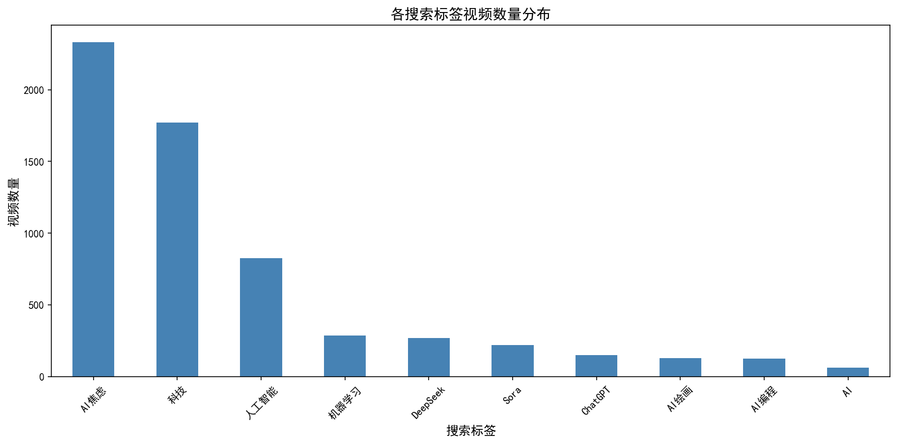
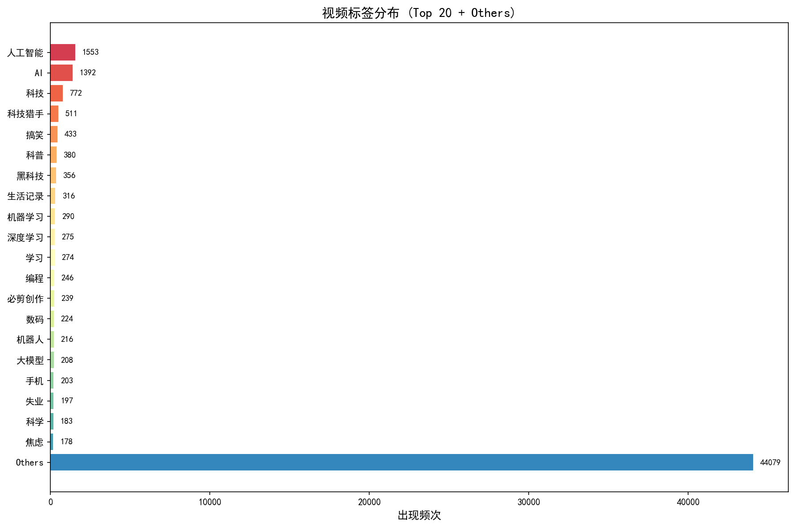
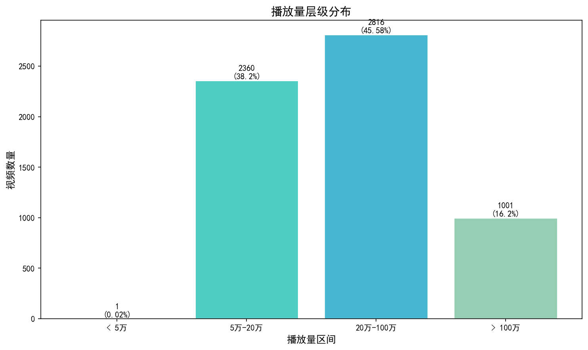

# 数据清洗前探索性分析报告 (Pre-clean EDA Report)

**生成时间**: 2026-04-10  
**数据文件**: `data/raw/bilibili_video_info.csv`

---

## 一、数据概览

| 指标 | 数值 |
|------|------|
| 数据总量 | 6,489 条 |
| 去重后视频数 | 6,178 条 |
| 重复记录数 | 311 条 |
| 缺失标签数 | 22 条 |

---

## 二、检索标签分布 (search_tag)

按搜索来源标签统计的去重视频数量：

| 排名 | 搜索标签 | 视频数量 | 占比 |
|------|----------|----------|------|
| 1 | AI焦虑 | 2,332 | 37.7% |
| 2 | 科技 | 1,770 | 28.6% |
| 3 | 人工智能 | 828 | 13.4% |
| 4 | 机器学习 | 289 | 4.7% |
| 5 | DeepSeek | 271 | 4.4% |
| 6 | Sora | 220 | 3.6% |
| 7 | ChatGPT | 152 | 2.5% |
| 8 | AI绘画 | 129 | 2.1% |
| 9 | AI编程 | 125 | 2.0% |
| 10 | AI | 64 | 1.0% |

---

## 三、视频真实标签分析 (tags)

### 3.1 标签总体统计

| 指标 | 数值 |
|------|------|
| 独立标签总数 | 16,142 个 |
| 标签出现总次数 | 52,525 次 |
| 平均每视频标签数 | 8.5 个 |

### 3.2 Top 20 标签明细

| 排名 | 标签 | 出现频次 |
|------|------|----------|
| 1 | 人工智能 | 1,553 |
| 2 | AI | 1,392 |
| 3 | 科技 | 772 |
| 4 | 科技猎手 | 511 |
| 5 | 搞笑 | 433 |
| 6 | 职场 | 380 |
| 7 | 在B站 | 356 |
| 8 | 记录 | 316 |
| 9 | 机器学习 | 290 |
| 10 | 深度学习 | 275 |
| 11 | 学习 | 274 |
| 12 | 绘画 | 246 |
| 13 | 关键技术 | 239 |
| 14 | 生活 | 224 |
| 15 | 大模型 | 216 |
| 16 | 规模 | 208 |
| 17 | 手机 | 203 |
| 18 | 失业 | 197 |
| 19 | 科学 | 183 |
| 20 | 教程 | 178 |
| - | **Others** | **44,079** |

**观察**: 
- 高频标签集中在技术类（人工智能、AI、机器学习、深度学习）和泛科技类（科技、科技猎手）
- "搞笑"、"职场"、"失业"等标签出现，反映了AI话题与社会议题的交叉
- "绘画"标签与AI绘画热潮相关

---

## 四、播放量层级分布

按播放量区间统计（基于去重后6,178条视频）：

| 播放量区间 | 视频数量 | 占比 | 说明 |
|------------|----------|------|------|
| < 5万 | 1 | 0.02% | ⚠️ 异常漏网/早期规则变动数据 |
| 5万-20万 | 2,360 | 38.20% | 中低流量区间 |
| 20万-100万 | 2,816 | 45.58% | 主流流量区间 |
| > 100万 | 1,001 | 16.20% | 爆款视频区间 |

**观察**:
- 主流流量集中在20-100万区间（45.58%）
- 超过16%的视频达到百万级播放，说明AI话题在B站具有较高热度
- 仅1条视频播放量<5万，验证了采集规则的有效性

---

## 五、数据质量问题记录

| 问题类型 | 数量 | 处理建议 |
|----------|------|----------|
| 重复记录 | 311 条 | 按bvid去重保留最新 |
| 缺失标签 | 22 条 | 保留，不影响核心分析 |
| 异常低播放量 | 1 条 | 标记为异常数据，可保留观察 |

---

## 六、结论与下一步

### 6.1 核心发现

1. **标签覆盖充分**: 16,142个独立标签，Top 20涵盖了AI核心技术、应用场景和社会影响
2. **数据质量良好**: 重复率仅4.8%，缺失值极少
3. **流量分布健康**: 近半数视频处于20-100万主流区间，16%达到爆款级别

### 6.2 下一步建议

- [ ] 进行数据清洗（去重、处理缺失值）
- [ ] 弹幕文本分析
- [ ] 深度建模分析

---

*报告由自动化脚本生成*
